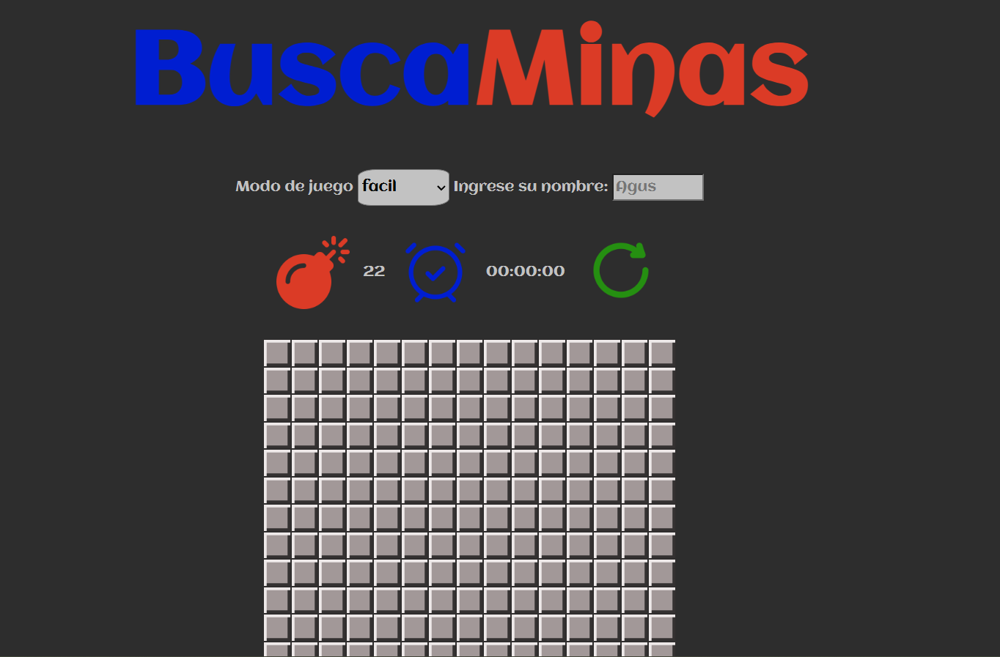
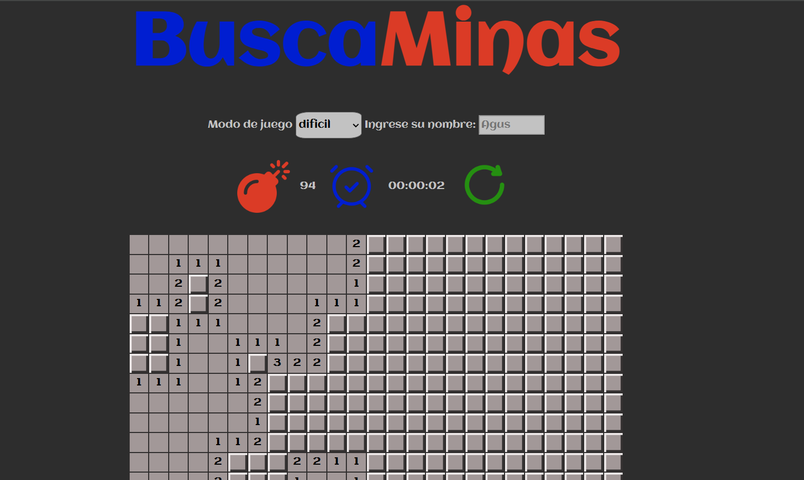

# Simple Minesweeper

This repository contains a project developed during the **third semester** of the **Systems Engineering** program at the **Catholic University of Córdoba**, as part of the course **Computer Lab 2** (Plan 2016).

🔗 **Project link**: [View Simple Minesweeper](https://ucc-labcompu2-historico.github.io/proyecto2023-perez-velasquez/)

👩‍🏫 **Professor**: Edme Agustina Aliciardi

---

## 🧠 Project Description

This is a basic implementation of the classic **Minesweeper** game using **HTML**, **CSS**, and **JavaScript**.

Key features include:

- A **dynamic board** that expands or contracts based on the selected difficulty.
- Allows the user to **enter a custom name**.
- A **restart button** with a spin animation.
- A **timer** that tracks the duration of the game.
- A custom **recursive function** designed to automatically reveal adjacent empty cells — one of the most fun and challenging parts of the development.

---

## 🖼️ Interface Preview

Here’s how the final version of the web application looks:

---

## 🔁 Recursive Logic in Action

Below is a screenshot illustrating the recursive function used to uncover adjacent empty cells during gameplay:

---

## 📁 Technologies Used

- HTML5  
- CSS3  
- Vanilla JavaScript

---

## 💬 Final Notes

This project was a great opportunity to strengthen my web development skills and explore recursive logic in JavaScript by building an interactive game from scratch.

---
